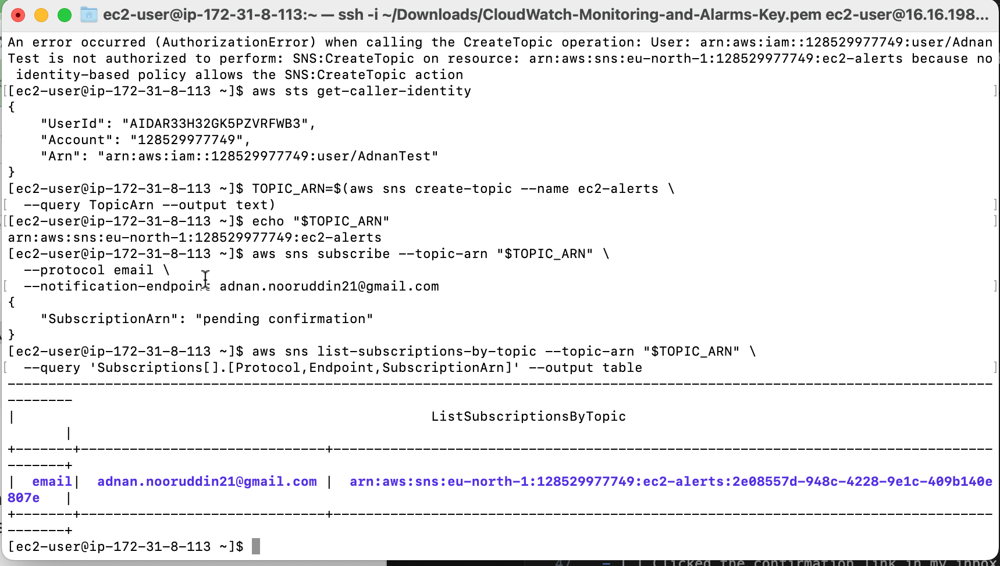
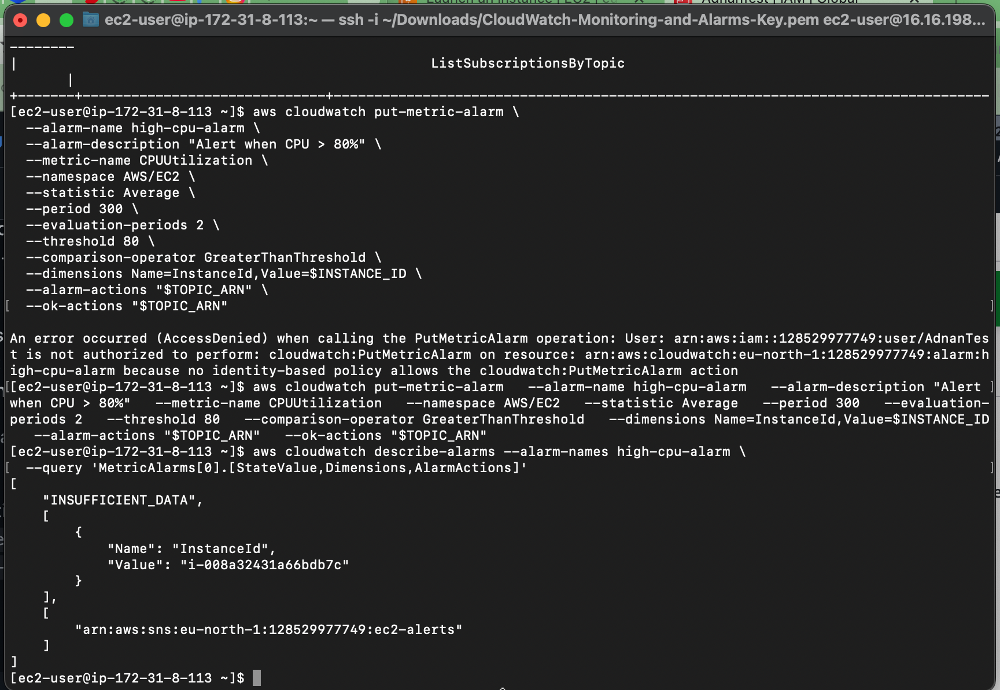
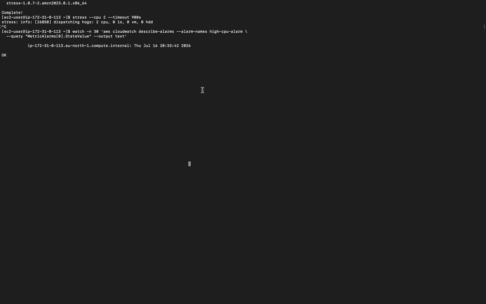
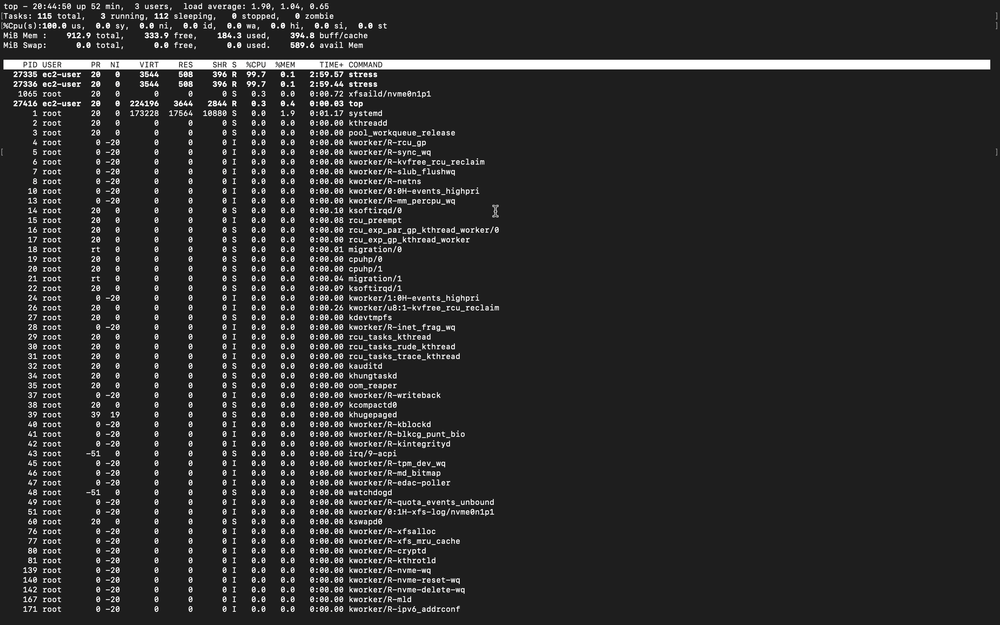
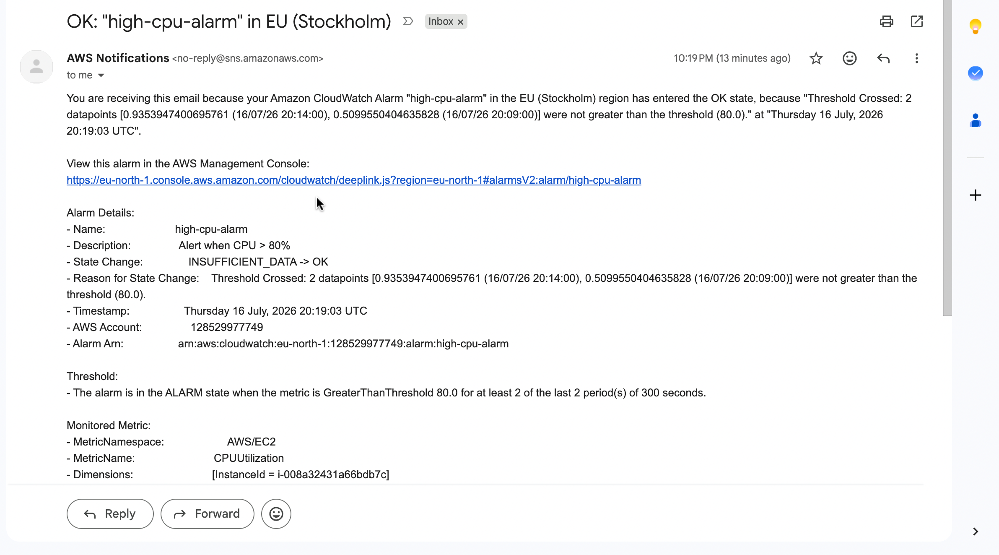

# CloudWatch Monitoring and Alarms Lab - Solution

**Student Name:** Adnan Nooruddin
**Date Completed:** 16.07.2026

---

# Environment Details

| Item | Value |
|------|-------|
| Instance ID | [i-xxxxxxxxxxxxx] |
| Region | [us-east-2] |
| SNS Topic Name | [ec2-alerts] |
| SNS Topic ARN | [arn:aws:sns:region:123456789012:ec2-alerts] |
| Notification Email | [you@email.com] |
| CPU Alarm Name | [high-cpu-alarm] |
| Status Check Alarm | [instance-status-check-alarm] |

- [x] All resources (instance, alarm, topic) are in the **same region**

---

# Step 1: Capture Your Instance ID

- [x] Retrieved the instance ID with `describe-instances` (or IMDSv2 on the instance)
- [x] Stored it in `INSTANCE_ID`

**My instance ID:** `i-008a32431a66bdb7c`

---

# Step 2: Create the SNS Topic and Subscribe

## Screenshot 5 – SNS Subscription

```
screenshots/05-sns-subscription.png
```



---

- [x] Topic `ec2-alerts` created, ARN captured in `TOPIC_ARN`
- [x] Subscribed my email with `aws sns subscribe`
- [x] Clicked the confirmation link in my inbox
- [x] `list-subscriptions-by-topic` shows a real `SubscriptionArn` (**not** `PendingConfirmation`)

---

# Step 3: Understand Alarm Latency

- [x] I understand basic monitoring publishes `CPUUtilization` every 5 minutes
- [x] `--period 300 --evaluation-periods 2` = 10+ minutes of sustained load before firing

---

# Step 4: Create the CPU Alarm

## Screenshot 2 – Alarm Creation

```
screenshots/02-alarm-creation.png
```



---

- [x] `high-cpu-alarm` created with `put-metric-alarm`
- [x] Bound to my instance via `--dimensions Name=InstanceId,Value=$INSTANCE_ID`
- [x] `--alarm-actions` and `--ok-actions` both point to my SNS topic
- [x] `describe-alarms` shows state `OK` or `INSUFFICIENT_DATA`

---

# Step 5: Create the Status Check Alarm

- [x] `instance-status-check-alarm` created for `StatusCheckFailed`
- [x] Uses `--statistic Maximum` (a status check is a 0/1 signal)

---

# Step 6: Stress Test the Instance

## Screenshot 1 – CloudWatch Metrics (CPU spike)

```
screenshots/01-cloudwatch-metrics-dashboard.png
```



## Screenshot 3 – Alarm Triggered (ALARM state)

```
screenshots/03-alarm-triggered.png
```



## Screenshot 6 – Email Notification

```
screenshots/06-email-notification.png
```



## Screenshot 4 – Alarm Resolved (OK state)

```
screenshots/04-alarm-resolved.png
```


---

- [x] Installed and ran `stress --cpu 2 --timeout 900s` on the instance
- [x] Confirmed the CPU was saturated with `top`
- [x] Waited 10–12 minutes
- [x] Alarm transitioned `OK → ALARM`
- [x] Received the notification email
- [x] After load stopped, alarm returned to `OK` and a second email arrived

---

# Step 7: Record the Timeline

- [x] Captured `describe-alarm-history` output to `alarm-timeline.txt`

### Alarm state transitions (from `describe-alarm-history`)

```text

------------------------------------------------------------------------------------
|                               DescribeAlarmHistory                               |
+-----------------------------------+----------------------------------------------+
|  2026-07-16T20:59:03.445000+00:00 |  Alarm updated from ALARM to OK              |
|  2026-07-16T20:51:03.444000+00:00 |  Alarm updated from OK to ALARM              |
|  2026-07-16T20:19:03.445000+00:00 |  Alarm updated from INSUFFICIENT_DATA to OK  |
+-----------------------------------+----------------------------------------------+


```

---

# Cleanup

- [x] Load test stopped (`stress` timed out or `Ctrl+C`)
- [x] Deleted the alarms (`delete-alarms`)
- [x] Deleted the SNS topic (`delete-topic`)
- [x] Instance **stopped** (not terminated — later labs reuse it)

---

# Submission Checklist

Repository name: `ce-lab-cloudwatch-monitoring` (**public**)

- [] `configs/` files committed (alarm config, SNS details, metrics query)
- [ ] `test-results/` files committed (stress-test log, alarm timeline)
- [x] All 6 screenshots present
- [x] `README.md` complete with the required explanations
- [x] SNS subscription **confirmed** (not PendingConfirmation)
- [x] CPU alarm bound to the correct `InstanceId`
- [x] Status check alarm created
- [x] Alarm observed in **ALARM** and back in **OK**
- [x] Notification email received and screenshotted
- [x] Account ID redacted (if I chose to)
- [x] Repository URL submitted
